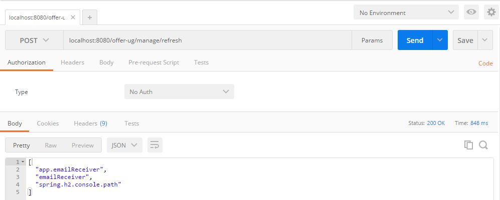

# Spring Cloud Config Server

## Refresh Properties
* Prerequisite: Classes need to be annotated with @RefreshScope (see examples below)
* Check existing properties
* TEST: `http://clearview-test-i01/offer-ug/manage/env`
* PREP: `http://clearview-preprod-i01/offer-ug/manage/env`
* PROD: `http://clearview-i01/offer-ug/manage/env`

* Change property on branch (e.g. clearview) of config git project
* TEST: `curl --user web:pwdOnTest 'http://clearview-test-i01/offer-ug/manage/refresh' -i -X POST`
* PREP: `curl --user web:<keePass> 'http://clearview-preprod-i01/offer-ug/manage/refresh' -i -X POST`
* PROD: `curl --user web:<keePass> 'http://clearview-i01/offer-ug/manage/refresh' -i -X POST`

## Setup a new application for Spring Cloud Config

### Git
* go to http://msswlmp01.ads.hel.kko.ch:7990/projects/INFRA/repos/config/browse and create a new custom branch (from master) with your application's name (e.g. clearview)
* clone the new branch, add yaml/properties files with values to be served by config server (e.g. application-local.yml and messages.properties), push

### Config server
* start this server on the same server as your application is running (by default it will come up on port 8888)
* check if the property files are served by config server (the syntax is `http://localhost:8888/<name-of-property-file>/<profile>/<your-app-name>` or `http://localhost:8888/<name-of-property-file>/<your-app-name>`)
* examples:

curl http://localhost:8888/application/local/clearview

```json
{
"name": "application",
"profiles": [
"local"
],
"label": "clearview",
"version": null,
"state": null,
"propertySources": [
{
"name": "ssh://git@msswlmp01.ads.hel.kko.ch:7999/infra/config.git/application-local.yml",
"source": {
"emailReceiver": "offer.business.cloud-refresh2@helsana-test.ch"
...
```

curl http://localhost:8888/messages/default/clearview

```json
{
"name": "messages",
"profiles": [
"default"
],
"label": "clearview",
"version": null,
"state": null,
"propertySources": [
{
"name": "ssh://git@msswlmp01.ads.hel.kko.ch:7999/infra/config.git/messages.properties",
"source": {
"other.insurer": "Anderer Versicherer Cloud"
...
```

### Setup config client in your application
* set the property `spring.cloud.config.label=clearview` in your application's application.yml or application.properties (label points to the branch created above)

* Annotate classes with @RefreshScope (see example below)
* restart your application
* use postman to send a POST to the refresh resource


## Examples (Optional)

use below code for testing if needed (replace app.emailReceiver with a property of your application)

```java
package ch.helsana.web.clearview.controller;

import org.springframework.beans.factory.annotation.Value;
import org.springframework.cloud.context.config.annotation.RefreshScope;
import org.springframework.web.bind.annotation.RequestMapping;
import org.springframework.web.bind.annotation.RestController;

@RestController
@RefreshScope
class ProjectNameRestController {

    @Value("${app.emailReceiver}")
    String spfServer;

    @RequestMapping("/api/spf-server")
    String spfServer() {
        return this.spfServer;
    }
}
```

below code is currently not working (tested with `http://localhost:8080/offer-ug/api/insurer`). The config server's rest endpoint `http://localhost:8888/messages/default/clearview` works fine.

```java
package ch.helsana.web.clearview.config;

import org.springframework.cloud.context.config.annotation.RefreshScope;
import org.springframework.context.MessageSource;
import org.springframework.context.annotation.Bean;
import org.springframework.context.annotation.Configuration;
import org.springframework.context.support.ReloadableResourceBundleMessageSource;
import org.springframework.web.servlet.LocaleResolver;
import org.springframework.web.servlet.i18n.SessionLocaleResolver;

import java.util.Locale;

@Configuration
public class MessageSourceConfig {

    @Bean
    @RefreshScope
    public MessageSource messageSource() {
        final ReloadableResourceBundleMessageSource messageSource = new ReloadableResourceBundleMessageSource();
        messageSource.setFallbackToSystemLocale(false);
        messageSource.setBasename("classpath:messages"); -- works (currently used)
        messageSource.setBasename("http://localhost:8888/messages/default/clearview"); -- doesn't work
        messageSource.setDefaultEncoding("UTF-8");
        return messageSource;
    }

    @Bean
    public LocaleResolver localeResolver() {
        SessionLocaleResolver slr = new SessionLocaleResolver();
        slr.setDefaultLocale(Locale.ENGLISH);
        return slr;
    }

}
```

## TODO's
* Make the config repo only accessible to IFF/IFA employees (WEB group) since it may contain confidential data


## Secret

Credentials password you can find on startup. 

#encrypt
```bash
curl -u user:1bbf8528-17c9-46b9-b520-6e110ff94305 localhost:8888/encrypt -d secretPassword 
```

or 
```bash
curl -X POST --data-urlencode secretPassword  -u user:2719fbad-e47d-46b1-b8c8-fb833c73565b localhost:8888/encrypt 
```


#decrypt

```bash
curl -u user:2719fbad-e47d-46b1-b8c8-fb833c73565b localhost:8888/decrypt  -d 51b0f067117ccd3f6487d2fb95a92c41a645976faf47f478dda66aeabad4c68d 

```

or 
```bash
curl -X POST --data-urlencode 51b0f067117ccd3f6487d2fb95a92c41a645976faf47f478dda66aeabad4c68d  -u user:2719fbad-e47d-46b1-b8c8-fb833c73565b localhost:8888/decrypt 
```


```bash


hkesq@WS-12000019196 MINGW64 /c/Users/Public/App/dev/git/FSL
$ curl -X POST --data-urlencode OtherSuperPassword  -u user:MySuperPassword localhost:8888/encrypt
  % Total    % Received % Xferd  Average Speed   Time    Time     Time  Current
                                 Dload  Upload   Total   Spent    Left  Speed
100    73  100    64  100     9     64      9  0:00:01 --:--:--  0:00:01 64000d354bd35a15b8a5a26f36aeea950f99f567b2bd013178eb0414f49f4a0faca97


hkesq@WS-12000019196 MINGW64 /c/Users/Public/App/dev/git/FSL
$ curl -X POST --data-urlencode b90b4efc95fe1b35d1cdc0ee5a9297c759bbfe33ef798160a58a160d57f394  -u user:MySuperPassword localhost:8888/decrypt
  % Total    % Received % Xferd  Average Speed   Time    Time     Time  Current
                                 Dload  Upload   Total   Spent    Left  Speed
100    73  100     9  100    64    195   1391 --:--:-- --:--:-- --:--:--  1391 OtherSuperPassword


```